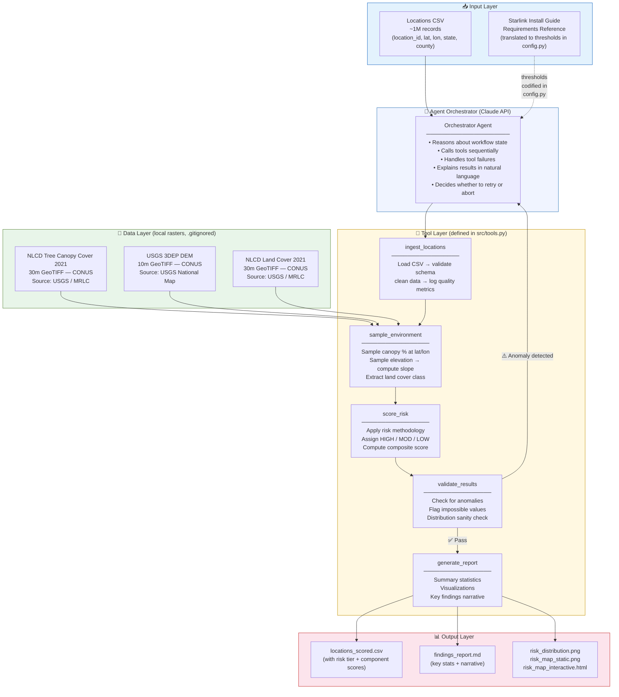
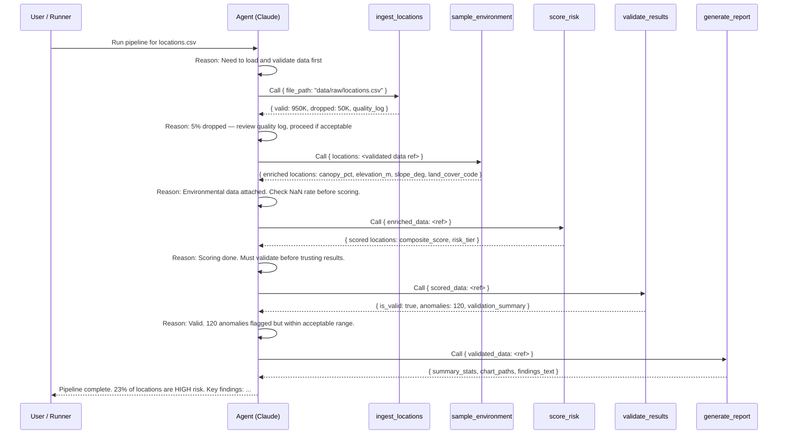

# System Architecture

**Project:** LEO Satellite Coverage Risk Analysis  
**Version:** 1.0  
**Last updated:** March 2026

---

## Overview

The pipeline is an **agent-orchestrated data system** that takes ~1M broadband locations (lat/lon) and produces a risk-scored output indicating which locations are likely to experience LEO satellite connectivity issues due to environmental obstructions.

The Claude API (via Anthropic's tool_use protocol) acts as the **reasoning layer**: it decides which tools to invoke, in what order, and how to handle failures or anomalies. The underlying Python functions do the actual computation — the agent provides the decision logic.

---

## High-Level System Diagram



---

## Agent Interaction Sequence



---

## Component Descriptions

### Agent Orchestrator (`src/agent.py`)

- **What it does:** Holds the conversation loop with Claude. Sends tool results back to Claude after each invocation and lets Claude decide what to call next.
- **Scope:** Reasoning, ordering, failure handling. Does NOT do computation.
- **Tool access:** All 5 tools.
- **State management:** The current scored DataFrame is held in memory and referenced by name between tool calls. A `PipelineState` dataclass tracks what has been completed.
- **Failure handling:** If a tool throws an exception, the agent receives the error message and can retry with adjusted parameters or abort gracefully with an explanation.

### Tool: `ingest_locations` (`src/ingest.py`)

- Loads the raw CSV with pandas.
- Validates schema (expected columns present), coordinate ranges, duplicate IDs.
- Returns a quality report (counts of dropped records and drop reasons).
- Saves cleaned data to `data/processed/`.

### Tool: `sample_environment` (`src/environment.py`)

- Downloads national rasters if not already present (canopy, DEM, land cover).
- Samples raster pixel values at each location's (lat, lon) using rasterio.
- Computes terrain slope from the DEM.
- Processes in batches of `config.BATCH_SIZE` (default 50K) for memory efficiency.
- Returns enriched DataFrame with `canopy_pct`, `elevation_m`, `slope_deg`, `land_cover_code`.

### Tool: `score_risk` (`src/risk_scoring.py`)

- Applies per-factor risk scorers (vectorized with numpy for 1M-row performance).
- Computes weighted composite score: `canopy×0.50 + slope×0.30 + landcover×0.20`.
- Assigns risk tier: HIGH (≥0.6), MODERATE (0.3–0.6), LOW (<0.3).
- All thresholds read from `config.py` — no hardcoded magic numbers.

### Tool: `validate_results` (`src/validation.py`)

- Checks for impossible values (canopy>100, slope<0).
- Checks score distribution — flags if >90% of locations land in one tier.
- Cross-validates: forest land cover + canopy<5% → anomaly.
- Returns `(is_valid: bool, validation_report: dict)`.

### Tool: `generate_report` (`src/reporting.py`)

- Computes summary statistics (tier distribution, top-risk states/counties).
- Generates static charts (bar, pie, scatter map).
- Writes findings narrative to `findings_report.md`.

---

## Data Flow and State Management

```
Raw CSV → [T1: ingest] → cleaned_locations.csv (data/processed/)
       → [T2: enrich] → enriched_locations.csv (data/processed/)
       → [T3: score]  → locations_scored.csv   (data/processed/)
       → [T4: validate] → validation_report.json (data/output/)
       → [T5: report]  → findings_report.md, charts (data/output/)
```

Each tool call persists its output to disk. If the pipeline is interrupted and restarted, completed steps can be skipped (file existence check in each tool). The agent is told which intermediate files exist at startup.

---

## Failure Handling

| Failure Scenario | Behavior |
|---|---|
| Missing raster file | `sample_environment` raises `FileNotFoundError` with download instructions; agent logs and informs user |
| Network failure during raster download | `download_raster` retries 3× with exponential backoff; raises after final failure |
| Locations all outside CONUS bounds | Validation raises `DataQualityError`; agent aborts and reports which file was provided |
| Validation anomaly rate too high | `validate_results` returns `is_valid=False`; agent reports anomalies and asks user whether to proceed |
| Claude API error | `PipelineAgent` catches and logs; non-agent fallback mode available via `main.py --mode batch --no-agent` |

---

## Production Considerations

This pipeline is a proof-of-concept optimized for a 4-day build sprint. For production deployment:

| Concern | POC Approach | Production Approach |
|---|---|---|
| Orchestration | Python `while` loop | Apache Airflow DAG |
| Raster storage | Local GeoTIFF files | Cloud-Optimized GeoTIFFs (COGs) on S3 |
| Scale | Serial batches (50K) | Distributed (Dask / Spark) |
| Raster access | Full CONUS download | GDAL Virtual File System reads from S3 COG |
| Monitoring | JSON log file | Prometheus + Grafana, LLM observability (LangSmith) |
| Drift detection | Manual | Quarterly scheduled reruns; alert if tier distribution shifts >5% |
| Data updates | NLCD 2021 (static) | Subscribe to MRLC update notifications; re-run on new releases |
