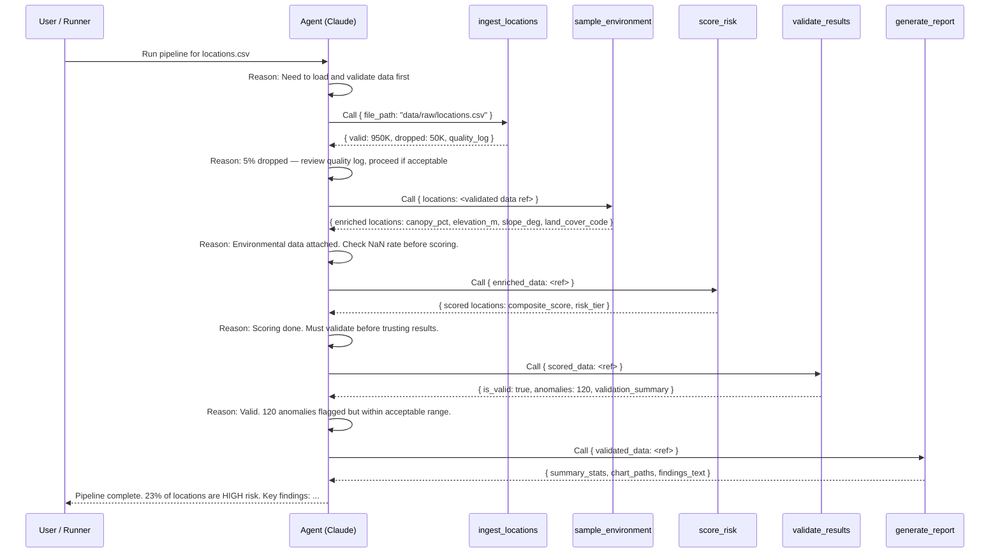

# System Architecture

**Project:** LEO Satellite Coverage Risk Analysis  
**Version:** 1.2  
**Last updated:** March 2026 (pipeline complete — Phase 6 verified, Phase 7 UI complete)

---

## Overview

The pipeline is an **agent-orchestrated data system** that takes 4,674,905 broadband locations (lat/lon) across North Carolina and produces a risk-scored output indicating which locations are likely to experience LEO satellite connectivity issues due to environmental obstructions.

**Verified result (2026-03-14):** 4,674,905 locations — HIGH 19.4% | MODERATE 31.3% | LOW 49.3% | UNKNOWN 0.0% — 100/100 NC counties — 0.0% NaN in all environmental columns.

The Claude API (via Anthropic's tool_use protocol) acts as the **reasoning layer**: it decides which tools to invoke, in what order, and how to handle failures or anomalies. The underlying Python functions do the actual computation — the agent provides the decision logic.

---

## High-Level System Diagram


---

## Agent Interaction Sequence



---

## Component Descriptions

### Agent Orchestrator (`src/agent.py`)

- **What it does:** `PipelineAgent` wraps the Anthropic `messages.create` API in an agentic loop. Sends tool results back to Claude after each invocation; Claude decides what to call next.
- **Scope:** Reasoning, ordering, failure handling. Does NOT do computation — all logic lives in the underlying Python modules.
- **Temperature:** Set to **0** (`CLAUDE_TEMPERATURE = 0.0` in `config.py`). This is a data pipeline, not a creative task. Temperature=0 ensures identical tool routing and output text for the same input data — critical for reproducibility when pipeline results feed into programme management decisions. See README Decision Log and config.py comments for rationale.
- **State management:** Batch pipeline tools communicate via **file paths** on disk. On-demand tools (`analyze_location`, `assess_area`) load the scored CSV once and cache the DataFrame in memory (`self._scored_df`) to avoid re-reading 4.67M rows on every interactive query.
- **Failure handling:** `handle_tool_call` wraps every Python call in `try/except` and returns structured error JSON if something goes wrong. Claude receives the error, reasons about the root cause, and decides whether to retry or report the issue.
- **Monitoring:** Every tool call records wall-clock execution time, success/failure, and result size. Total token usage (input + output) is tracked from API responses. Written to `data/output/agent_monitoring_report.json` at the end of each run.
- **Three run modes:**
  - `run_pipeline(csv_path)` — batch: processes the full locations CSV end-to-end. Uses **all** tools (PIPELINE_TOOLS + ON_DEMAND_TOOLS).
  - `run_interactive(query)` — on-demand: used by the UI chat and CLI `--mode interactive`. Uses **ON_DEMAND_TOOLS only** (`tools_override=ON_DEMAND_TOOLS`); batch pipeline tools are not exposed, so the agent cannot call `ingest_locations`, `sample_environment`, `score_risk`, `validate_results`, or `generate_report`. This keeps chat fast and ensures only cached scored data is used (no re-downloads or raster sampling).
  - `--mode pipeline-only` (via `main.py`) — runs the 5-step batch sequence without any API calls, useful when credits are unavailable.
- **Tool routing:** In interactive mode Claude can only call `analyze_location`, `assess_area`, and `query_top_counties`. For "which county has the most low/high risk locations?" it uses `query_top_counties(state, tier)` which reads the scored CSV only.

### Tool: `analyze_location` — on-demand single-point assessment

Serves the **field technician use case**: a technician enters an address or coordinates and gets a complete risk briefing without knowing GIS.

- **Input resolution (`src/utils/geocoding_utils.py`):** Accepts three input formats:
  - Free-text US address (`"1600 Amphitheatre Pkwy, Mountain View, CA"`) → geocoded via **Nominatim (OpenStreetMap, free, no API key)**
  - Coordinate string (`"47.6062, -122.3321"`) → parsed directly, no geocoding
  - Explicit lat/lon floats → used as-is
- **Lookup strategy:** First tries to find the nearest pre-scored location within 150m in the scored CSV. If not found (new location not in the dataset), attempts **on-the-fly raster scoring** if all three rasters are available — otherwise returns a helpful error with pipeline instructions.
- **Factor breakdown (Tool A):** Returns the composite score, risk tier, all three factor values and their weighted contributions (both absolute and percentage), the primary risk driver, and a plain-English recommendation tailored to that driver and tier.
- **Nearby alternatives (Tool B):** Finds up to 10 lower-risk scored locations within the specified radius (default 500m), sorted by distance. Each alternative includes location_id, distance_m, risk_tier, canopy_pct, and composite_score — so the technician can evaluate nearby options.
- **Seasonal context (Tool D):** If the land cover is Deciduous Forest (NLCD code 41), adds a note that NLCD captures peak-summer canopy and that November–March leaf drop reduces effective obstruction by 30–60%. This is not available in any existing satellite connectivity tool and is a genuine domain-expertise signal.

**Why not CloudRF or DishPointer?** CloudRF models RF propagation for GEO satellites (single fixed dish direction). Starlink LEO uses a 100° FOV sky-dome model across 60+ simultaneous satellites — CloudRF's directional model does not apply. DishPointer has no public API. Our NLCD + 3DEP analysis uses the exact data sources that govern Starlink obstruction. At 4.67M locations, our pipeline is orders of magnitude faster than any existing single-location tool.

### Tool: `assess_area` — state/county risk briefing

Serves the **programme manager use case**: an ISP or state broadband office needs a risk briefing for an entire county or state.

- Filters the scored CSV to the requested state (2-letter abbreviation) or county (NAMELSAD, e.g. `"Whatcom County"`).
- Returns tier distribution, environmental averages per tier, primary risk driver across HIGH-tier locations, top-N highest-risk counties within the state (or top locations within a county), and a plain-English paragraph suitable for a programme status report.
- Uses the same `self._scored_df` cache as `analyze_location` — loaded once per session.

### Tool: `assess_polygon` — custom area (bbox or polygon)

Serves **custom geographic area** queries (e.g. "risk in this rectangle", "risk in this polygon").

- Accepts either **bbox:** `min_lat`, `max_lat`, `min_lon`, `max_lon` (fast filter on scored CSV) or **coordinates:** list of `[lat, lon]` points forming a polygon (uses shapely + geopandas point-in-polygon).
- Returns same structure as `assess_area`: tier distribution, env averages, primary driver, top counties in area, briefing. Read-only from scored CSV.

### Tool: `query_top_counties` — top counties by risk tier (on-demand, read-only)

Serves **aggregation questions** in the UI chat (e.g. "which county has the highest number of low risk locations?").

- Reads only the existing scored CSV; no raster sampling or downloads.
- Parameters: `state` (required), `tier` (HIGH / MODERATE / LOW, default LOW), `top_n` (default 15).
- Returns the top N counties by count of locations in that tier, plus percentages of state total. Used so chat answers stay fast and never trigger the batch pipeline.

### Tool: `ingest_locations` (`src/ingest.py`)

- Loads the raw CSV with pandas (`geoid_cb` forced to `str` dtype to preserve leading zeros).
- Derives `state`, `county`, and `county_fips` in two stages:
  - **Stage 1 — Census GEOID (primary, ~99% of rows):** Parses `geoid_cb` to extract state FIPS and county FIPS. `state` is looked up via the [`us`](https://pypi.org/project/us/) library (`us.states.lookup(fips).abbr` → `"CA"`). `county` is looked up via [`pygris`](https://pypi.org/project/pygris/) which fetches the official Census TIGER/Line cartographic boundary file and returns the `NAMELSAD` field (e.g. `"Santa Clara County"`, `"Orleans Parish"`) — no hardcoded dictionary, scales automatically as the Census updates. `county_fips` (e.g. `"06085"`) is kept as a separate column for FCC/BEAD data joins.
  - **Stage 2 — Reverse geocoding (fallback, rows with null/malformed GEOID only):** `reverse_geocoder` (offline GeoNames KD-tree) provides `county` from `admin2` (kept as-is, no suffix stripping) and `state` from `admin1` via `us.states.lookup()`. Only fires for the small fraction of rows where Stage 1 produced nulls — not wastefully on all 4.67M rows.
- **Five sequential validation passes** (each tracked separately in the quality report):
  1. **Type coercion** — lat/lon non-numeric strings (e.g. `"N/A"`, `"abc"`) → coerced; unconvertible rows dropped with reason `non_numeric_latitude` / `non_numeric_longitude`.
  2. **Null / blank critical columns** — null `location_id`/`latitude`/`longitude` dropped; whitespace-only `location_id` (`"   "`) dropped with reason `blank_location_id`.
  3. **CONUS coordinate bounds** — rows outside the continental US bounding box dropped.
  4. **Duplicate location_id** — keep first occurrence, drop subsequent.
  5. **Invalid state code** — derived state not in the 50-state + DC set dropped.
- Returns a quality report (counts of dropped records per reason, retention rate).
- Saves cleaned data to `data/processed/`.

### Tool: `sample_environment` (`src/environment.py`)

- Downloads national rasters if not already present (canopy, DEM, land cover).
- Samples raster pixel values at each location's (lat, lon) using rasterio.
- Computes terrain slope from the DEM.
- Processes in batches of `config.BATCH_SIZE` (default 50K) for memory efficiency.
- Returns enriched DataFrame with `canopy_pct`, `elevation_m`, `slope_deg`, `land_cover_code`.

### Tool: `score_risk` (`src/risk_scoring.py`)

- Applies per-factor risk scorers (vectorized with numpy for 1M-row performance).
- Computes weighted composite score: `canopy×0.50 + slope×0.30 + landcover×0.20`.
- Assigns risk tier: HIGH (≥0.6), MODERATE (0.3–0.6), LOW (<0.3).
- All thresholds read from `config.py` — no hardcoded magic numbers.

### Tool: `validate_results` (`src/validation.py`)

- Checks for impossible values (canopy>100, slope<0).
- Checks score distribution — flags if >90% of locations land in one tier.
- Cross-validates: forest land cover + canopy<5% → anomaly.
- Returns `(is_valid: bool, validation_report: dict)`.

### Tool: `generate_report` (`src/reporting.py`)

- **Phase 6 (current):** `generate_summary_stats()` computes tier distribution, environmental averages per tier, state-level breakdown, and top-20 counties by HIGH-risk count. Writes a human-readable Markdown findings report to `data/output/findings_report.md`.
- **Phase 7 (planned):** Visualisation stubs (`create_risk_distribution_chart`, `create_static_risk_map`, `create_interactive_map`) will be fully implemented.

---

## Data Flow and State Management

```
Raw CSV → [T1: ingest] → cleaned_locations.csv (data/processed/)
       → [T2: enrich] → enriched_locations.csv (data/processed/)
       → [T3: score]  → locations_scored.csv   (data/processed/)
       → [T4: validate] → validation_report.json (data/output/)
       → [T5: report]  → findings_report.md, charts (data/output/)
```

Each tool call persists its output to disk. If the pipeline is interrupted and restarted, completed steps can be skipped.

**Idempotency / cache check** (`src/utils/pipeline_utils.py`):  
At startup the agent calls `is_scored_cache_valid(input_path, output_path)`. If `locations_scored.csv` already exists and is newer than the input CSV, the agent skips the entire ingest→enrich→score pipeline and calls `load_scored_cache()` instead. This avoids re-running the 20–60 minute raster sampling step on unchanged data. To force a full re-run, delete `data/processed/locations_scored.csv`.

---

## Failure Handling

| Failure Scenario | Behavior |
|---|---|
| Missing raster file | `sample_environment` raises `FileNotFoundError` with download instructions; agent logs and informs user |
| Network failure during raster download | `download_raster` retries 3× with exponential backoff; raises after final failure |
| Locations all outside CONUS bounds | Validation raises `DataQualityError`; agent aborts and reports which file was provided |
| Validation anomaly rate too high | `validate_results` returns `is_valid=False`; agent reports anomalies and asks user whether to proceed |
| Claude API error | `PipelineAgent` catches and logs; non-agent fallback mode available via `main.py --mode batch --no-agent` |

---

## Testing Strategy

**Total tests:** 250 (all passing, ~7 seconds)

| Test file | Tests | Purpose |
|---|---|---|
| `tests/conftest.py` | (shared fixtures) | Programmatic in-memory DataFrames + GeoTIFFs; no committed binary files |
| `tests/test_environment.py` | 41 | Raster download, GeoTIFF sampling, slope computation, CRS reprojection |
| `tests/test_ingest.py` | 35 | Load, validate (5 passes), quality report, all edge cases |
| `tests/test_risk_scoring.py` | 28 | Scoring functions, composite arithmetic, tier boundaries |
| `tests/test_validation.py` | 36 | Anomaly detection, cross-validation, impossible values |
| `tests/test_integration.py` | 29 | **Real data** sampled from DATA_CHALLENGE_50.csv — full ingest→score→validate→report |
| `tests/test_on_demand_tools.py` | 61 | `analyze_location` + `assess_area` dispatch; factor math; seasonal context |

**Unit tests** (conftest-based): Test specific edge cases with programmatic fixtures.  No CSV file required.

**Integration tests** (`test_integration.py`): 1000 rows randomly sampled from the real CSV at test time. Verify NC-specific invariants (state='NC', county NAMELSAD format, county_fips starts with '37', coordinates within NC bounding box). Also catch the column-name bug (`canopy_risk` vs `canopy_score`) that would have silently corrupted factor breakdowns.

**On-demand tool tests** (`test_on_demand_tools.py`): Bypass the API by pre-loading `_scored_df` directly in the agent instance. Test all routes, including errors, without any Anthropic credit usage.

---

## Production Considerations

This pipeline is a proof-of-concept optimized for a 4-day build sprint. For production deployment:

| Concern | POC Approach | Production Approach |
|---|---|---|
| Orchestration | Python `while` loop | Apache Airflow DAG |
| Raster storage | Local GeoTIFF files | Cloud-Optimized GeoTIFFs (COGs) on S3 |
| Scale | Serial batches (50K) | Distributed (Dask / Spark) |
| Raster access | Full CONUS download | GDAL Virtual File System reads from S3 COG |
| Monitoring | JSON log file | Prometheus + Grafana, LLM observability (LangSmith) |
| Drift detection | Manual | Quarterly scheduled reruns; alert if tier distribution shifts >5% |
| Data updates | NLCD 2021 (static) | Subscribe to MRLC update notifications; re-run on new releases |

---

## Scale Architecture — Path to Production

The POC runs on a single laptop. Below is the full production-grade architecture for scaling to national coverage, real-time queries, and multi-team usage.

### Data Platform (Snowflake + dbt)

```
Raw Layer (S3)                Transformation Layer (dbt)          Serving Layer (Snowflake)
─────────────────             ─────────────────────────────       ─────────────────────────
DATA_CHALLENGE_50.csv  ─────► dbt model: stg_locations            TABLE: locations_raw
(4.67M NC, future US)         • validate schema                   TABLE: locations_validated
                              • derive state/county                TABLE: locations_enriched
NLCD Canopy TIF (S3)  ──┐    • check coordinate bounds           TABLE: locations_scored
NLCD Landcover TIF (S3) ├───► dbt model: fct_scored_locations     TABLE: county_risk_summary
USGS DEM TIF (S3) ──────┘     • canopy_risk, slope_risk          VIEW:  high_risk_locations
                              • composite_score, risk_tier
                              • incremental materialisation
```

**Why Snowflake:**
- All 4.67M rows plus raster-sampled values fit easily (< 1 GB structured data)
- SQL-based analysis by programme managers without Python knowledge
- `GEOGRAPHY` data type for native spatial queries (e.g. `ST_WITHIN(point, county_polygon)`)
- Semi-structured JSON for storing agent tool outputs
- Time-travel for auditing score changes across NLCD update cycles

**Why dbt:**
- Reproducible, version-controlled transformations — every scoring formula change is a diff
- Lineage graph: immediately see which locations were affected by a threshold change
- Built-in data tests (schema validation, uniqueness, not-null) replace custom pandas code
- Incremental models: re-score only changed or new locations, not the full 4.67M every time

### Orchestration (Apache Airflow)

```
Airflow DAG: leo_risk_pipeline
┌────────────────────────────────────────────────────────────────────────────┐
│  check_new_locations    detect_nlcd_updates    validate_input_schema       │
│         │                      │                        │                   │
│         └──────────────────────┼────────────────────────┘                  │
│                                ▼                                            │
│              sample_rasters_distributed  (Dask cluster, 93 partitions)     │
│                                │                                            │
│                      dbt_run_fct_scored_locations                           │
│                                │                                            │
│              validate_results  ──────────────────►  alert_on_anomaly       │
│                                │                                            │
│              generate_county_aggregates                                     │
│                                │                                            │
│              refresh_api_cache  ──────────────────►  notify_ui_update      │
└────────────────────────────────────────────────────────────────────────────┘
```

- **Schedule:** Triggered by S3 event (new location CSV uploaded) or quarterly (NLCD update)
- **Retry policy:** Each task retries 3× with exponential backoff — mirrors current `download_raster` logic
- **Alerting:** Slack/email on validation failure or UNKNOWN tier rate > 10%
- **No manual steps:** The current "download DEM manually" requirement is replaced by a managed S3 sync from USGS 3DEP COG bucket

### AWS Infrastructure

```
                         ┌─────────────────────────────────────────┐
                         │              AWS Region (us-east-1)      │
                         │                                          │
  Ready.net CSV  ──────► │  S3: raw-locations/                      │
  upload                 │  S3: nlcd-rasters/ (COG mirrors)         │
                         │                                          │
                         │  ECS Fargate: Airflow workers            │
                         │  (raster sampling, dbt runs)             │
                         │                                          │
  Field Technician ────► │  API Gateway → Lambda: /analyze          │
  (mobile browser)       │  (PipelineAgent on-demand tools,         │
                         │   no Anthropic API key in prod)          │
                         │                                          │
  Programme Manager ───► │  CloudFront → S3: static Flask app       │
  (dashboard browser)    │  (pre-built React/Leaflet bundle)         │
                         │                                          │
                         │  Snowflake: all scored data + aggs        │
                         │  RDS Postgres: API cache + sessions       │
                         └─────────────────────────────────────────┘
```

**Key decisions:**
- Raster sampling runs on **ECS Fargate** (not Lambda — raster files are too large for Lambda's 512 MB /tmp)
- On-demand location analysis runs on **Lambda** (stateless, < 100ms for pre-scored lookup, < 5s for on-the-fly scoring)
- The Anthropic Claude API is used for **batch orchestration reasoning** only — the Lambda function calls Python scoring functions directly, no LLM needed for individual queries
- **COG approach:** NLCD canopy and landcover are mirrored to S3 as Cloud-Optimized GeoTIFFs. GDAL `/vsicurl/` reads individual windows without downloading the full 3.7GB file — a single 30m pixel lookup reads < 1 KB from S3

### Scaling Numbers

| Dimension | POC | Production |
|---|---|---|
| Locations | 4.67M (NC) | 140M+ (US national broadband map) |
| Raster sampling time | ~60 min (serial) | ~8 min (93 Dask partitions × 2 cores) |
| On-demand query latency | < 1s (local CSV) | < 200ms (Snowflake cached agg) |
| Concurrent users | 1 (CLI) | 1,000+ (API Gateway + Lambda) |
| Data refresh cycle | Manual | Automated (S3 event trigger) |
| Storage cost (scored data) | Free (local) | ~$5/month (Snowflake XS, 4.67M rows) |

### LLM Observability (LangSmith / Langfuse)

In production, every Claude API call is traced:
- Input prompt + tool schemas logged (for debugging routing failures)
- Tool call sequence recorded (was the correct order followed?)
- Token usage + latency per call (for cost optimization)
- A/B testing: compare claude-opus-4-5 vs claude-haiku-4-5 routing quality on real queries

---

## Phase 7 — Interactive Web UI (Implemented)

### What Was Built

A single-page interactive web application that exposes the pipeline's outputs
visually and wraps `analyze_location` / `assess_area` via the Claude agent.

**Target users:**
- **Field technicians** — search an address or tap "Use GPS" → full risk
  breakdown + nearby alternatives (LLM narrative)
- **Programme managers** — click any NC county → `assess_area` briefing in sidebar (LLM)

**Run:** `python -m app.run` → http://127.0.0.1:5001 (port 5001 avoids macOS AirPlay on 5000)

### Architecture

```
Browser (Leaflet.js + vanilla JS)
    │
    ├── GET /                    → index.html (map + sidebar + search)
    ├── GET /report              → findings_report.md as HTML
    ├── GET /api/stats           → tier distribution (JSON)
    ├── GET /api/countries       → countries from dataset (Country dropdown)
    ├── GET /api/map-data        → NC county GeoJSON + risk stats (choropleth)
    ├── GET /api/map-points      → 24k sampled points (cluster layer)
    ├── POST /api/analyze        → PipelineAgent.run_interactive(query) → LLM markdown; out_of_coverage when outside NC (still returns analysis)
    ├── GET /api/county/<name>   → PipelineAgent.run_interactive("briefing for X County") → LLM markdown
    ├── GET /admin               → Data team: stats, bar/pie chart, static map (from data/output/)
    ├── GET /output/<path>       → Serve risk_distribution.png, risk_map_static.png
    └── POST /api/chat           → Same as interactive CLI; returns markdown + optional lat/lon for map zoom

Flask backend (app/app.py)
    │
    ├── Loads locations_scored.csv on first use (in-memory cache)
    ├── /api/countries, /api/counties — always 200; fallbacks (US for country, pygris NC list for counties) if scored file missing
    ├── /api/stats, /api/map-data, /api/map-points — pandas/pygris (503 if no scored file)
    ├── /api/analyze, /api/county, /api/chat — PipelineAgent(model=CLAUDE_MODEL) → Anthropic API
    └── /admin — summary stats + interactive Plotly chart dashboard (bar, pie, scatter map; on-the-fly from scored CSV)
```

**Note on GPS support:** The "Use GPS" button uses the browser's
`navigator.geolocation.getCurrentPosition()` API. On desktop this uses IP/WiFi
geolocation. On mobile (field technicians), it uses the device GPS — accurate to
< 10m. The resulting lat/lon is passed directly to `/api/analyze`. This is
documented as a future GPS-first mobile feature when the app is deployed as a
PWA (Progressive Web App).

### Map Layers

| Layer | What it shows | Toggle / control |
|---|---|---|
| Basemap | Dark (CARTO) or **Satellite** (Esri World Imagery) | Layer control (top-right) |
| County choropleth | % HIGH risk per county — red/amber/green fill; when "Show risk overlay" is off, only fill is hidden; **outlines** stay | "Show risk overlay" (style only; layer always on) |
| Risk points | 24k points in three cluster layers (High / Moderate / Low); visible whenever overlay is on or off (only county fill toggles) | High/Moderate/Low checkboxes |
| Statewide stats | Sidebar counts (e.g. 0.91M HIGH, Total 4.67M) | Always visible; not affected by overlay toggle |

**Point interaction:** Hover shows tooltip (lat, lon, tier). Click runs single-location assessment and shows "Location detail" in the left pane with Download report.

### Pages / Views

1. **Dashboard** (default) — NC map + **resizable** sidebar. **Country** (from data/fallback), **State** (NC), **County** ("All counties" + full NC list; select one to zoom). **Risk toggles** (High / Moderate / Low). Stats, search, GPS.
2. **Location detail panel** — Shown when user **clicks a point** on the map. Displays lat/lon, full `analyze_location` narrative for that location only, and **Download report** (saves as .md).
3. **Location search panel** — Address or coordinates + Analyze; shows full `analyze_location` output. Outside NC: agent still runs; banner "Limited data — NC only" + full response.
4. **County briefing panel** — Shown when user **clicks a county polygon**; `assess_area` tier breakdown + narrative.
5. **Chat panel** — Natural-language query (same as `--mode interactive --query "..."`); response in chat log + left panel; map zooms to parsed coordinates when present.
6. **Admin** (`/admin`) — Data team: summary stats, bar + pie chart (tier distribution), static scatter map, top counties table. Charts from `create_risk_distribution_chart` and `create_static_risk_map` (reporting.py), generated during pipeline run.

### Real Data — Pipeline Already Run

The UI requires `data/processed/locations_scored.csv`. **This file has been generated.**
It contains real environmental values sampled from three official US government rasters.

**Status (2026-03-14): COMPLETE — `data/processed/locations_scored.csv` exists with 4,674,905 rows.**

For reference, the full download + run sequence (see [docs/guide.md](guide.md)):

```bash
# Step 1: NLCD Tree Canopy Cover 2021 (3.7 GB, one-time)
curl -L "https://www.mrlc.gov/downloads/sciweb1/shared/mrlc/data-bundles/nlcd_tcc_CONUS_2021_v2021-4.zip" \
  -o data/raw/nlcd_tcc_conus_2021.zip && cd data/raw && unzip nlcd_tcc_conus_2021.zip && cd ../..

# Step 2: NLCD Land Cover 2021 (40 MB, NC extent via WCS — idempotent)
python scripts/download_nc_landcover.py

# Step 3: USGS 3DEP DEM (~1.15 GB, NC extent — idempotent)
python scripts/download_nc_dem.py

# Step 4: Run full pipeline (~8 min for 4.67M rows)
python -m src.main
```

All three scripts include idempotency guards — re-running after a successful
download returns immediately without re-downloading.

### Why the Anthropic API Is Used in the UI

The UI uses the Anthropic Claude API for the on-demand analysis features (`analyze_location`,
`assess_area`). This is intentional and central to the value proposition:

- **Structured data** (risk tier, factor scores, alternatives list) is computed by
  Python functions directly — rendered immediately in the UI panels.
- **Agent narrative** — Claude generates a plain-English explanation of WHY this
  location has this risk, what the primary driver is, and what the technician
  should do about it. This is not templated text; it is genuine reasoning.
- **Open-ended chat** — a technician can ask "what counties in NC are safe for
  installation during winter?" and Claude reasons over the scored data to answer.

This is the agent-driven pipeline in action — the same Claude model that orchestrated
the batch pipeline is now serving field technicians interactively.

---
